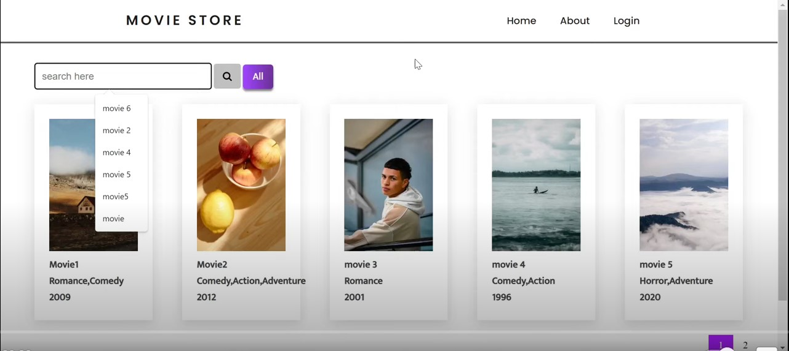

# MovieStoreMvc

It is a source code of youtube tutorial. `MovieStoreMvc` is a fullstack application which displays various movies along with there genres. A movie can have multiple genres. It is a good project for beginners, they can learn to develop fullstack app with authentication and also can learn many to many relationship.

## Tech stack and tools used

- Visual Studio 2022
- .Net 6 (Now upgraded to .net 9.0)
- EF Core
- AspnetCore Identity
- SQL Server

## Youtube tutorial link

[MovieStoreMVC](https://www.youtube.com/watch?v=cQ3HH0MJqDs)

## How to run it?

1. clone the project
   `git clone https://github.com/rd003/MovieStoreMvc.git`
2. open `appsettings.json` file and update connection string's `data source=your server name`
   
   ``` 
    "ConnectionStrings": {
          "conn": "data source=your_server_name;initial catalog=MovieStoreMvc; integrated security=true;encrypt=false"
     }
   ```
3. Open Tools > Package Manager > Package manager console
4. Run the command `update-database`.
5. Now you can run this project.

## Script for seeding data

```sql
USE MovieStoreMvc;
GO

-- Insert Genres
INSERT INTO [dbo].[Genre] ([GenreName]) VALUES ('Action');
INSERT INTO [dbo].[Genre] ([GenreName]) VALUES ('Science Fiction');
INSERT INTO [dbo].[Genre] ([GenreName]) VALUES ('Drama');
INSERT INTO [dbo].[Genre] ([GenreName]) VALUES ('Comedy');
INSERT INTO [dbo].[Genre] ([GenreName]) VALUES ('Thriller');

GO

-- Insert Movies
INSERT INTO [dbo].[Movie] ([Title], [ReleaseYear], [MovieImage], [Cast], [Director])
VALUES ('Inception', '2010', 'inception.jpg', 'Leonardo DiCaprio, Joseph Gordon-Levitt, Ellen Page', 'Christopher Nolan');

GO

INSERT INTO [dbo].[Movie] ([Title], [ReleaseYear], [MovieImage], [Cast], [Director])
VALUES ('The Dark Knight', '2008', 'dark-knight.jpg', 'Christian Bale, Heath Ledger, Aaron Eckhart', 'Christopher Nolan');

GO

INSERT INTO [dbo].[Movie] ([Title], [ReleaseYear], [MovieImage], [Cast], [Director])
VALUES ('Parasite', '2019', 'parasite.jpg', 'Song Kang-ho, Lee Sun-kyun, Cho Yeo-jeong', 'Bong Joon-ho');

GO

INSERT INTO [dbo].[Movie] ([Title], [ReleaseYear], [MovieImage], [Cast], [Director])
VALUES ('The Grand Budapest Hotel', '2014', 'grand-budapest.jpg', 'Ralph Fiennes, Tony Revolori, Saoirse Ronan', 'Wes Anderson');

GO

INSERT INTO [dbo].[Movie] ([Title], [ReleaseYear], [MovieImage], [Cast], [Director])
VALUES ('Ex Machina', '2014', 'ex-machina.jpg', 'Alicia Vikander, Domhnall Gleeson, Oscar Isaac', 'Alex Garland');

GO

-- Insert MovieGenre relationships
-- Inception (Action, Sci-Fi, Thriller)
INSERT INTO [dbo].[MovieGenre] ([MovieId], [GenreId]) VALUES (1, 1); -- Action
INSERT INTO [dbo].[MovieGenre] ([MovieId], [GenreId]) VALUES (1, 2); -- Sci-Fi
INSERT INTO [dbo].[MovieGenre] ([MovieId], [GenreId]) VALUES (1, 5); -- Thriller

GO

-- The Dark Knight (Action, Drama, Thriller)
INSERT INTO [dbo].[MovieGenre] ([MovieId], [GenreId]) VALUES (2, 1); -- Action
INSERT INTO [dbo].[MovieGenre] ([MovieId], [GenreId]) VALUES (2, 3); -- Drama
INSERT INTO [dbo].[MovieGenre] ([MovieId], [GenreId]) VALUES (2, 5); -- Thriller

-- Parasite (Drama, Thriller)
INSERT INTO [dbo].[MovieGenre] ([MovieId], [GenreId]) VALUES (3, 3); -- Drama
INSERT INTO [dbo].[MovieGenre] ([MovieId], [GenreId]) VALUES (3, 5); -- Thriller

-- The Grand Budapest Hotel (Comedy, Drama)
INSERT INTO [dbo].[MovieGenre] ([MovieId], [GenreId]) VALUES (4, 4); -- Comedy
INSERT INTO [dbo].[MovieGenre] ([MovieId], [GenreId]) VALUES (4, 3); -- Drama

-- Ex Machina (Science Fiction, Drama, Thriller)
INSERT INTO [dbo].[MovieGenre] ([MovieId], [GenreId]) VALUES (5, 2); -- Sci-Fi
INSERT INTO [dbo].[MovieGenre] ([MovieId], [GenreId]) VALUES (5, 3); -- Drama
INSERT INTO [dbo].[MovieGenre] ([MovieId], [GenreId]) VALUES (5, 5); -- Thriller

```

## How to Register as a admin and login?

1. There is a controller `UserAuthentication` and a commented method `Register`. Uncomment the `Register` method
2. Run the project and hit the url `https://localhost:7095/UserAuthentication/Register`. You will be registered as a admin. Now you can re-comment the register user (for privacy).
3. Now you can login with credentials `Username: admin, password: Admin@123`

## Screenshots


